# 2025年最值得读的14本CRM书籍推荐

你是不是也在头疼：市面上CRM书籍那么多,到底该读哪本?有的书标题唬人,打开一看全是水;有的看着专业,但写于十年前,现在看简直是老古董。

这篇文章直接帮你筛选出14本真正有料的CRM书籍。每本书我都看了亚马逊评分、读者评价,还特地标注了它们在2025年是否还能用得上。不管你是刚接触CRM的新手,还是想深入研究某个具体软件(Hubspot、Salesforce、Dynamics 365),这里都能找到适合你的那一本。

---

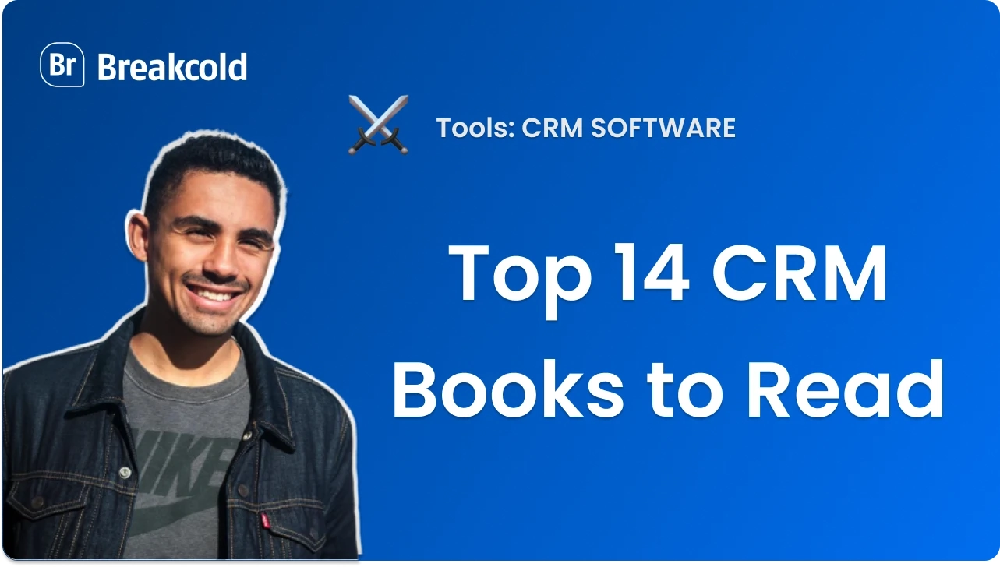

## CRM书籍1:《破解CRM密码》作者:Limesh Parekh

完整书名:《Cracking the CRM Code: How to Prevent Failures in Buying, Implementing and Using CRM》(破解CRM密码:如何避免购买、实施和使用CRM时的失败)

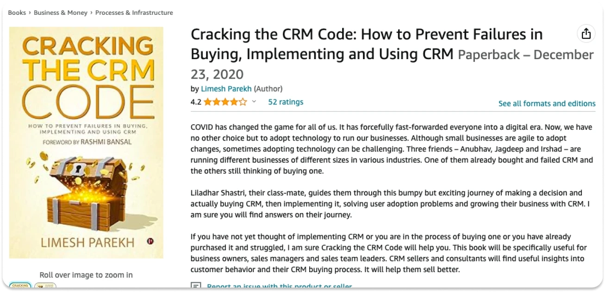

### 内容概要

这本书用虚构案例讲了一件事:Covid彻底改变了CRM的玩法。重点放在CRM实施上——这也是大多数企业最容易踩坑的地方。

### 是否专注于CRM?

是的,整本书都在讲怎么"破解"CRM。

### 2025年还有用吗?

书是2020年12月出的。虽然提到了疫情对CRM的影响,但当时疫情才刚开始,很多后续变化它没能预测到,所以内容有点过时了。

### 亚马逊评分:4.2/5

根据我的调查,这是亚马逊上关于CRM最相关的书籍之一。

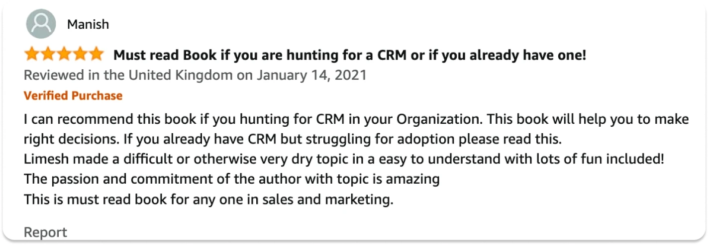

**最有用的负面评价**

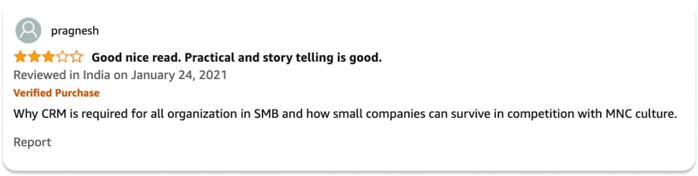

### 价格:平装版$14.99,Kindle版$9.99

如果选择有声书版本,可能更便宜或免费。

---

## CRM书籍2:《Breakcold销售CRM大师课》作者:Arnaud Belinga

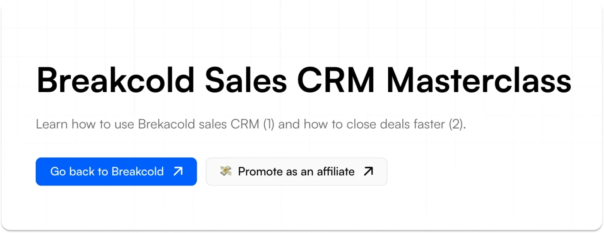

这本书专门针对一个特定的销售CRM:Breakcold。

### 内容概要

这是一套针对CRM初学者的培训课程,主要面向代理公司创始人和咨询顾问。内容涵盖CRM实施、CRM使用,以及如何用LinkedIn CRM制定B2B销售策略。👉 [想了解如何用社交媒体加速成交?点击这里探索现代CRM的社交销售玩法](https://www.scraperapi.com/?fp_ref=coupons)

### 是否专注于CRM?

是的,全程只讲CRM,特别是销售CRM的实际应用。

### 2025年还有用吗?

这本书/课程写于2024年4月,讲的是现代CRM应该如何利用社交媒体更快地完成交易——非常符合当下趋势。

**最有用的正面评价**

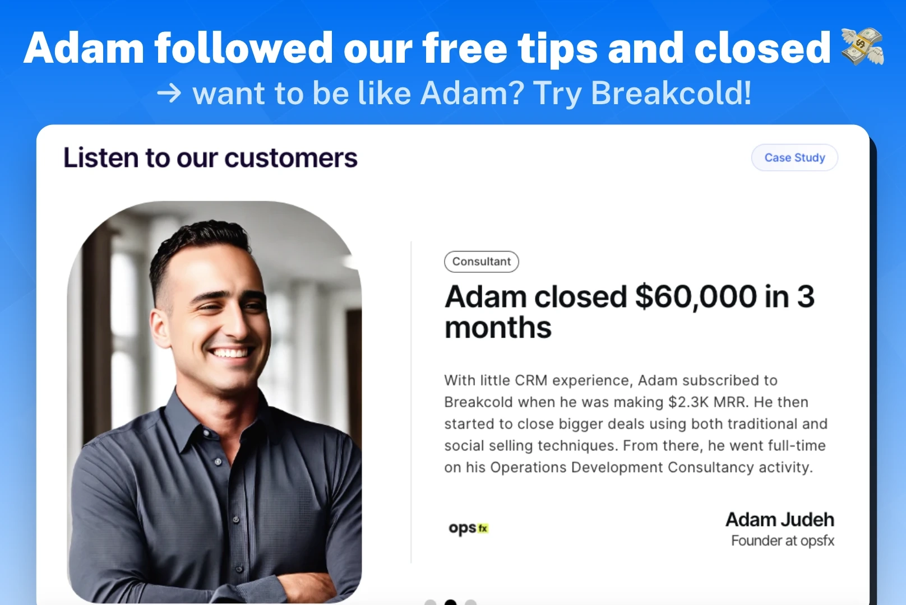

---

## CRM书籍3:《客户关系管理》作者:Francis Buttle和Stan Maklan

完整书名:《Customer Relationship Management: Concepts and Technologies》(客户关系管理:概念与技术)

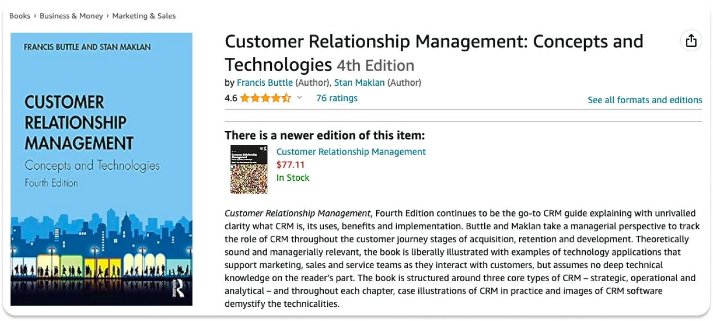

### 内容概要

通过实例和图解,这本书解释了什么是客户关系管理,以及如何使用相关软件。值得注意的是,这本书在亚马逊上有76条评价,是我找到的评价数最多的书之一。

### 是否专注于CRM?

是的,专注于CRM。

### 2025年还有用吗?

2019年5月出版,超过468页。这是那种讲基础概念的书,所以比较经得起时间考验。

### 亚马逊评分:4.6/5

结合评价数量来看,这是亚马逊上评分最高的CRM书籍。

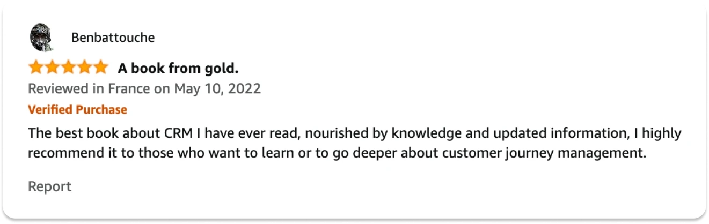

**最有用的负面评价**

无。

### 价格:平装版$68.98

---

## CRM书籍4:《CRM入门指南》作者:Lars Helgeson

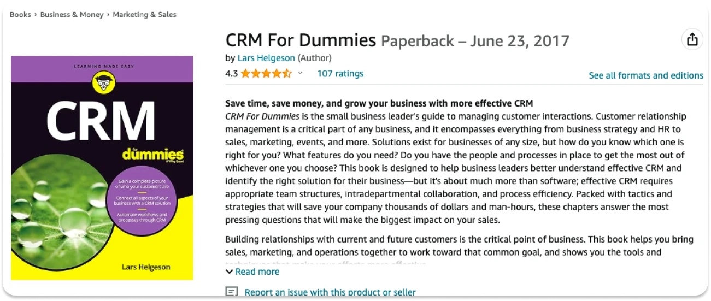

### 内容概要

这是著名"For Dummies"(入门系列)中的CRM版本。跟所有入门系列一样,这本书深入浅出地讲解了什么是CRM,以及它如何帮助你发展业务。

### 是否专注于CRM?

除了"For Dummies"这几个字,书名其他部分就是"CRM",不能更专注了。

### 2025年还有用吗?

2017年6月出版,所以缺少了社交CRM这一块——尤其是如何在CRM软件中使用Twitter或LinkedIn来加速B2B销售。

### 亚马逊评分:4.3/5

**最有用的正面评价**

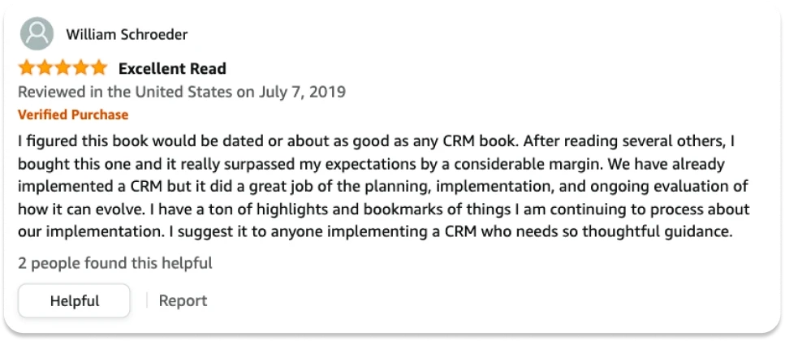

**最有用的负面评价**

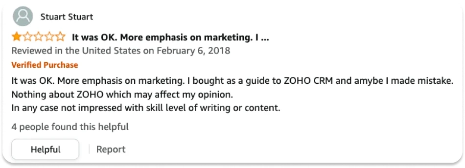

### 价格:平装版$26.21,Kindle版$18

---

## CRM书籍5:《CRM的艺术》作者:Max Fatouretchi

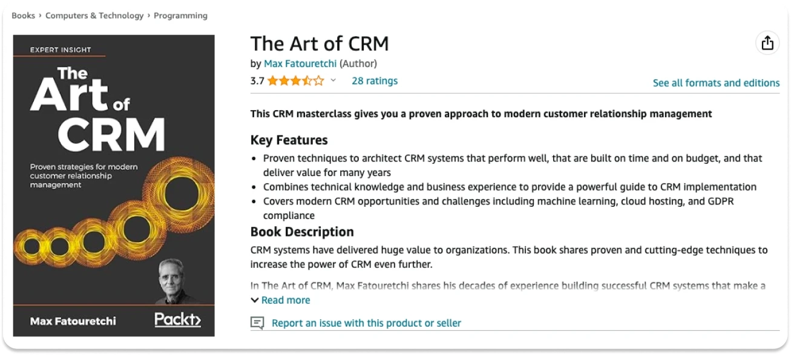

### 内容概要

这是一位拥有20多年经验的CRM老手写的360页CRM大师课。

### 是否专注于CRM?

是的,专注于CRM。

### 2025年还有用吗?

2019年5月出版。没有覆盖疫情后出现的新一波CRM产品。

### 亚马逊评分:3.7/5

**最有用的正面评价**

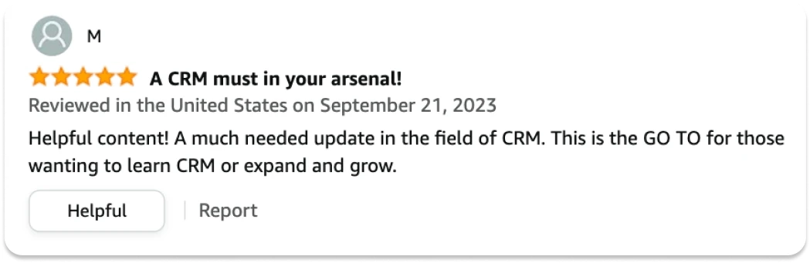

**最有用的负面评价**

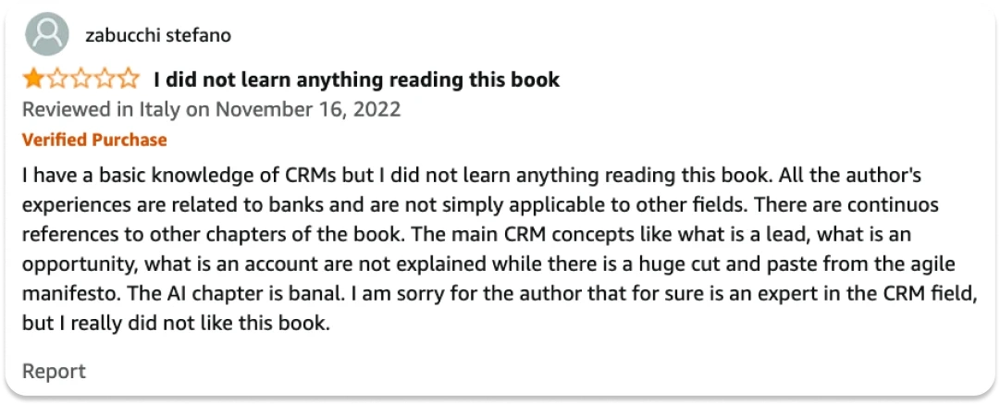

### 价格:平装版$41.99,Kindle版$18.49

---

## CRM书籍6:《你懂CRM吗?》作者:Omer Lizotte

完整书名:《Do you CRM me?: An Analytical Guide to Customer Relationship Management》(你懂CRM吗?:客户关系管理分析指南)

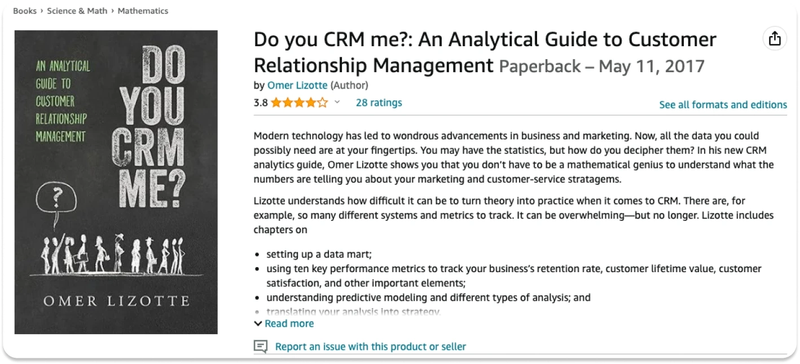

### 内容概要

这是一本关于客户关系管理的分析指南。重点放在仪表板和数据分析上,比如如何设置数据集市、理解客户生命周期价值、客户满意度等。

### 是否专注于CRM?

书籍专注于CRM,但也涉及B2B销售概念。

### 2025年还有用吗?

2017年5月出版,开始有点过时了。

### 亚马逊评分:3.8/5

**最有用的正面评价**

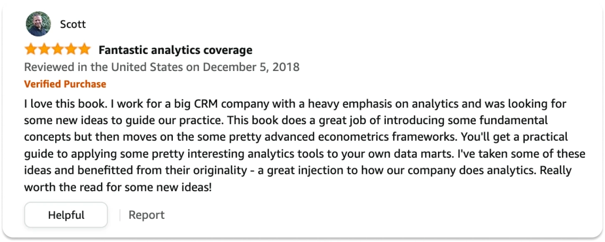

**最有用的负面评价**

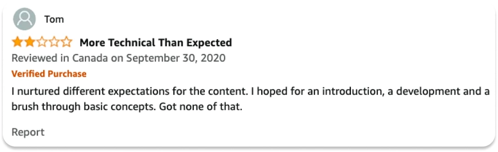

### 价格:平装版$9.99,Kindle版$4.99

这是列表中最实惠的书之一!

---

## CRM书籍7:《HubSpot CRM简化指南》作者:Ramanathan J

完整书名:《HubSpot CRM Simplified: Win more customers, grow your business and make more money with HubSpot CRM》(HubSpot CRM简化:用HubSpot CRM赢得更多客户、发展业务、赚更多钱)

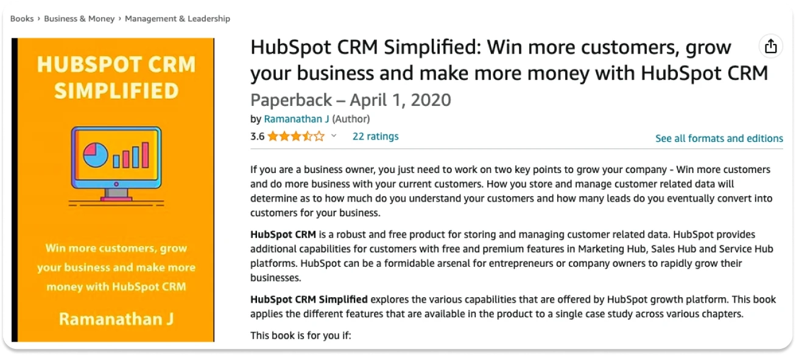

### 内容概要

如果你是Hubspot CRM的重度用户,这本书正适合你。它帮助读者简化Hubspot的使用——毕竟这软件默认状态下挺复杂的。

### 是否专注于CRM?

专门针对Hubspot CRM。

### 2025年还有用吗?

2020年4月出版,所以没有涵盖Hubspot后续发布的最新功能。

### 亚马逊评分:3.6/5

**最有用的负面评价**

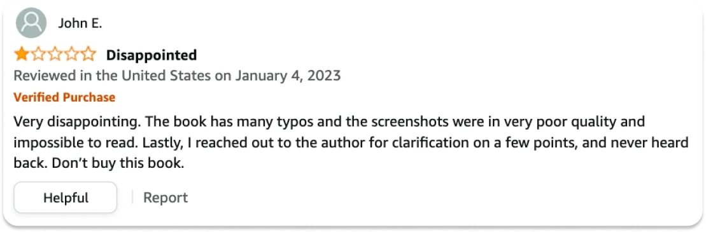

### 价格:平装版$9.99

---

## CRM书籍8:《成为超级Salesforce顾问》作者:Heather Black

完整书名:《Become a Super Salesforce Consultant: Superpower your Salesforce career with this A-to-Z guide on how to lead a Salesforce project》(成为超级Salesforce顾问:用这本A到Z指南为你的Salesforce职业生涯赋能,教你如何领导Salesforce项目)

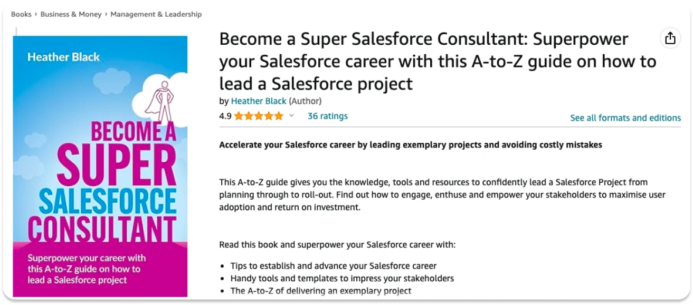

### 内容概要

这本书面向为客户实施Salesforce的顾问。目标是避免在Salesforce项目中犯代价高昂的错误。

### 是否专注于CRM?

专门针对Salesforce,而且只针对顾问——如果你想全面了解CRM,使用场景比较窄。

### 2025年还有用吗?

2023年11月出版,在Salesforce CRM的当前状态方面非常新。给顾问的建议也很经典,所以这本书会长期保持相关性。

### 亚马逊评分:4.9/5

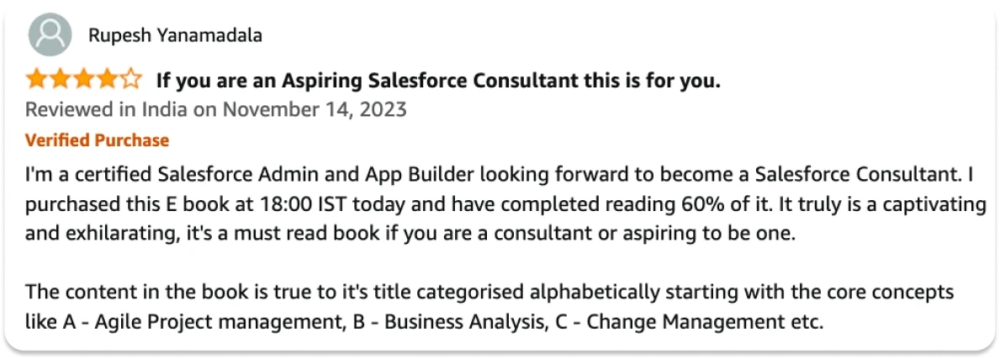

**最有用的负面评价**

无。

### 价格:平装版$19.98,Kindle unlimited用户免费

---

## CRM书籍9:《数字CRM:策略与新兴趋势》作者:Marco Bardicchia

完整书名:《Digital CRM: Strategies and Emerging Trends: Building Customer Relationship in the Digital Era》(数字CRM:策略与新兴趋势:在数字时代建立客户关系)

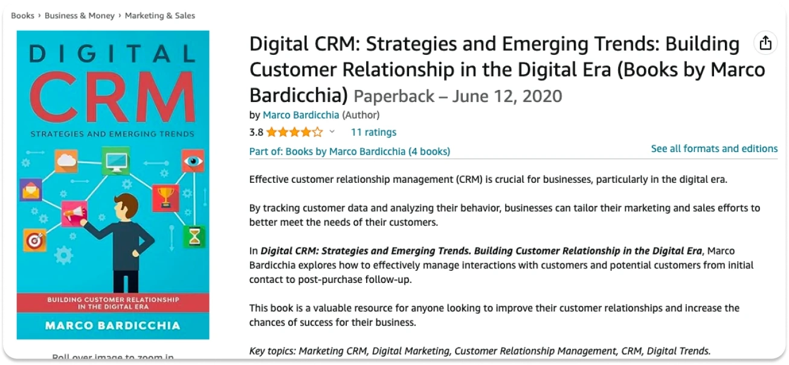

### 内容概要

这本书面向数字业务所有者,如代理公司、咨询顾问或初创公司。它讲解了CRM趋势和关键主题,如营销CRM或数字营销。

### 是否专注于CRM?

专注于数字CRM,主要面向想要实施CRM的社交媒体营销代理公司。

### 2025年还有用吗?

2020年6月出版,所以可能缺少一些新兴的关键CRM产品。

### 亚马逊评分:3.8/5

**最有用的正面评价**

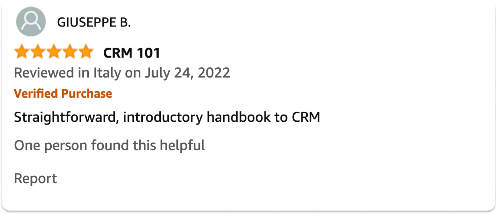

**最有用的负面评价**

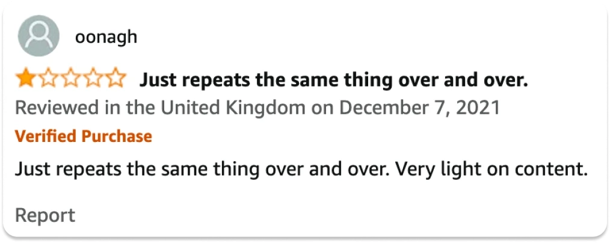

### 价格:平装版$75,Kindle版$0.00

---

## CRM书籍10:《用HubSpot赋能营销和销售》作者:Resa Gooding

完整书名:《Empowering Marketing and Sales with HubSpot: Take your business to a new level with HubSpot's inbound marketing, SEO, analytics, and sales tools》(用HubSpot赋能营销和销售:用HubSpot的集客营销、SEO、分析和销售工具将你的业务提升到新水平)

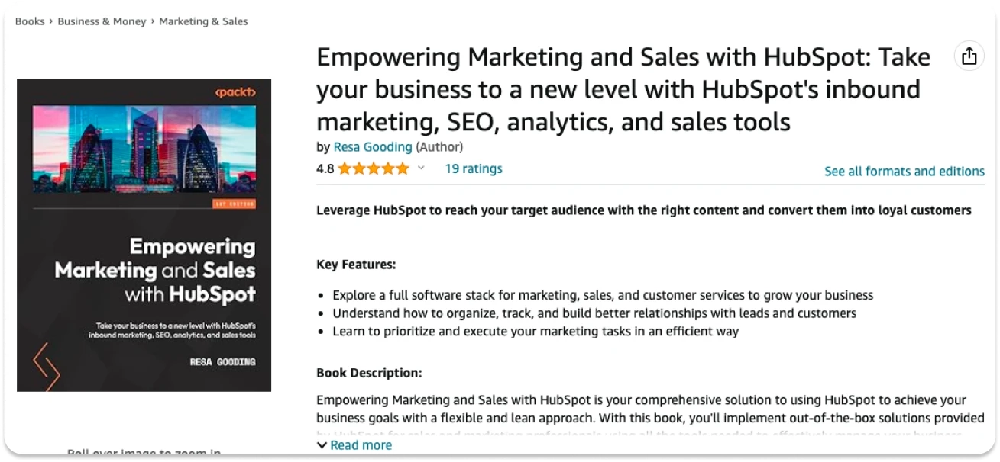

### 内容概要

又一本关于Hubspot CRM的书。不过这本深入讲解了营销和销售方面,以及软件的SEO功能。

### 是否专注于CRM?

是的,专门针对Hubspot——全球第二大CRM,仅次于Salesforce。

### 2025年还有用吗?

2022年7月出版,共476页,所以相当有参考价值。

### 亚马逊评分:4.8/5

**最有用的正面评价**

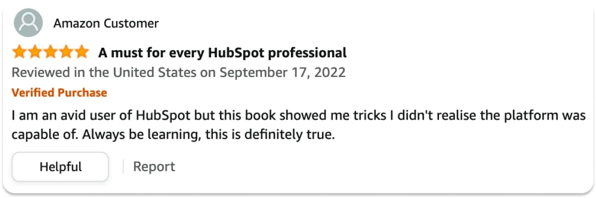

**最有用的负面评价**

无。

### 价格:平装版$34.99,Kindle版$17.19

---

## CRM书籍11:《Dynamics 365和Power Platform的CRM基础》作者:Nicolae Tarla

完整书名:《Fundamentals of CRM with Dynamics 365 and Power Platform: Enhance your customer relationship management by extending Dynamics 365 using a no-code approach》(Dynamics 365和Power Platform的CRM基础:使用无代码方法扩展Dynamics 365来增强你的客户关系管理)

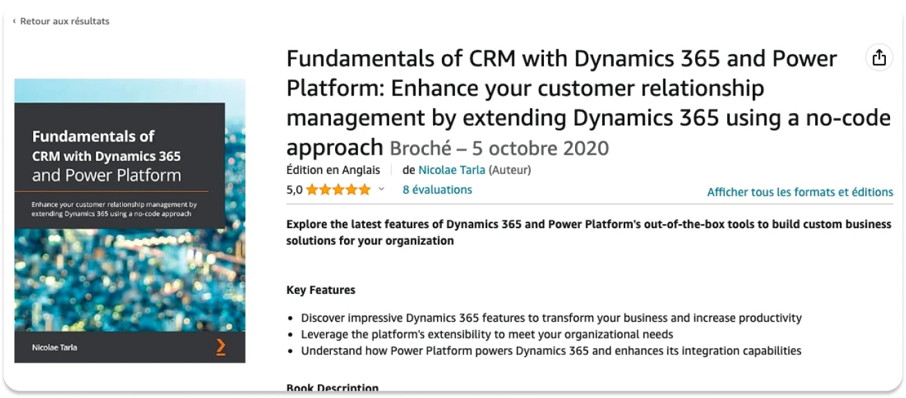

### 内容概要

这本书采用了独特的视角,可能是这里唯一一本专注于Dynamics 365的书——通常没人会讲这个。从这个角度来说,这本书为读者发现如何正确使用Dynamics 365作为CRM提供了极好的指导。

### 是否专注于CRM?

专门针对一个CRM:Dynamics 365。

### 2025年还有用吗?

2020年10月出版。Dynamics不是一个变化很快的软件,所以这本书依然相关。

### 亚马逊评分:4/5

**最有用的正面评价**

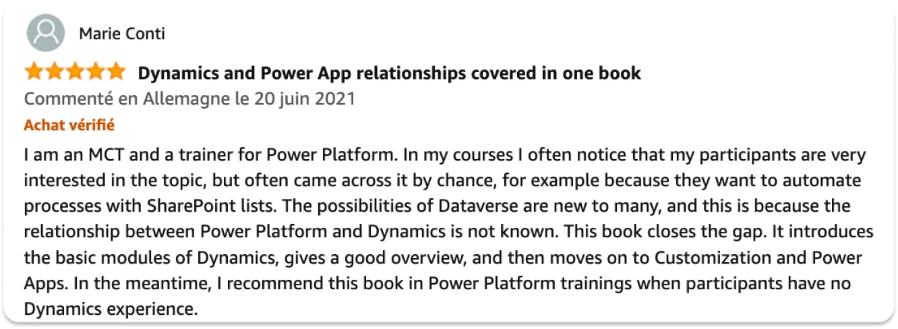

**最有用的负面评价**

无。

### 价格:平装版$34.99

---

## CRM书籍12:《管理SugarCRM》作者:Megan Sheehan

完整书名:《Administering SugarCRM (CRM Foundation Series Book 2)》(管理SugarCRM,CRM基础系列第2本)

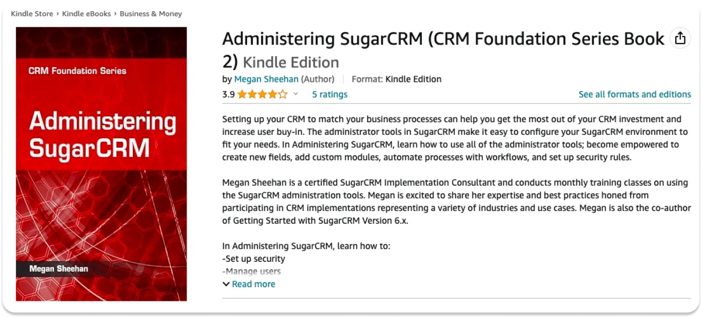

### 内容概要

这是我在亚马逊上找到的唯一一本讲SugarCRM的书——而SugarCRM可是CRM类别的主要领导者之一。这本书由一位经过认证的SugarCRM实施顾问撰写,她也做培训。

### 是否专注于CRM?

是的,专门针对SugarCRM。

### 2025年还有用吗?

2014年3月出版,距今已经超过10年了。可以说在此期间SugarCRM的收入翻了一番,现在是一个完全不同的软件了。

### 亚马逊评分:3.9/5

**最有用的正面评价**

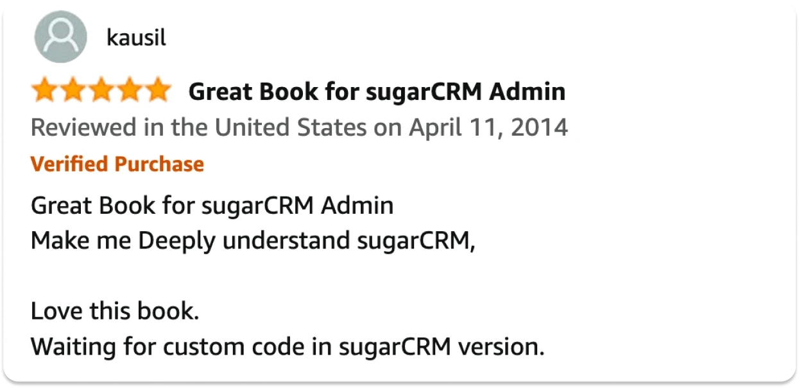

**最有用的负面评价**

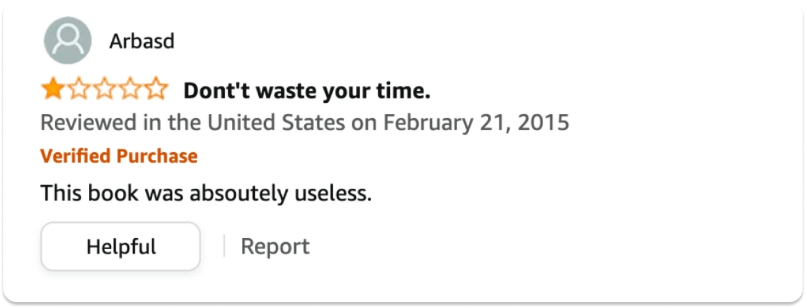

### 价格:平装版$49.99

---

## CRM书籍13:《从洞穴到城堡》作者:Atuksha Poonwassie

完整书名:《Cave To Castle: How To Transform Any Property Business Using Customer Relationship Management (CRM)》(从洞穴到城堡:如何使用客户关系管理(CRM)改变任何房地产业务)

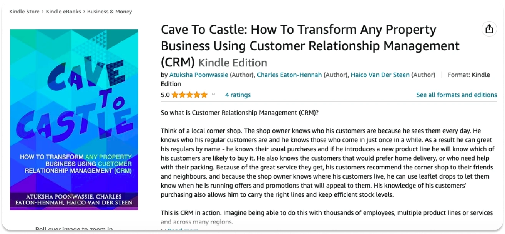

### 内容概要

这本书专注于房地产业务,也就是一般的实体中小企业。它用虚构的例子(比如街角小店)来解释如何让你的CRM发挥作用,从而推动更多销售。

### 是否专注于CRM?

是的,专门针对需要CRM的中小企业。

### 2025年还有用吗?

2015年7月出版,相当过时了——中小企业这些年经历了重大变化,特别是疫情之后。

### 亚马逊评分:5/5

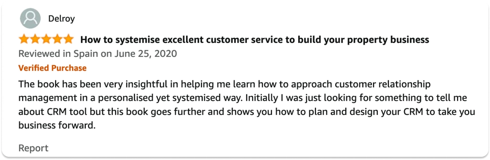

**最有用的负面评价**

无。

### 价格:Kindle版$19.99

---

## CRM书籍14:《HubSpot对比Salesforce》作者:Aldo B. Miller

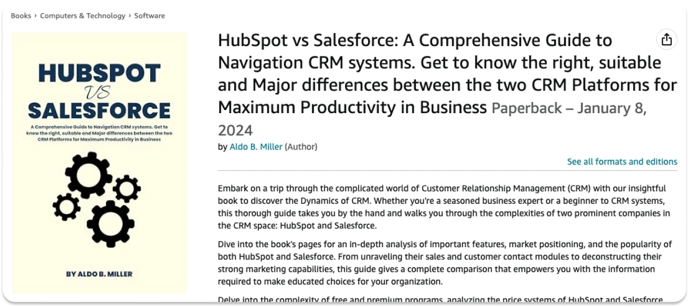

### 是否专注于CRM?

绝对是。

### 2025年还有用吗?

2024年1月出版,所以非常相关。

### 价格:平装版$12.99

---

## 总结

看完这14本书,你应该能找到适合自己的那一本了。如果你刚接触CRM,可以从《CRM入门指南》或《客户关系管理:概念与技术》开始;如果你已经在用某个特定软件,那就直接找对应的专门书籍。

👉 [想要更快上手CRM实践?点击这里了解如何用现代工具提升客户管理效率](https://www.scraperapi.com/?fp_ref=coupons)

记住:读书是为了解决实际问题,不是为了收藏。选一本最符合你当下需求的,读完就去实践,这才是正经事。
